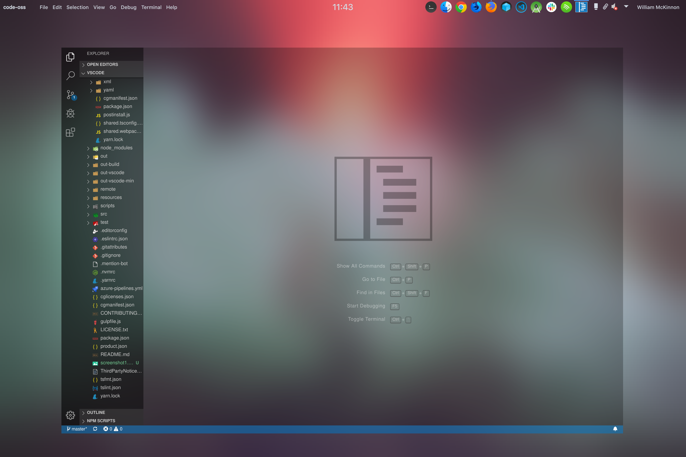
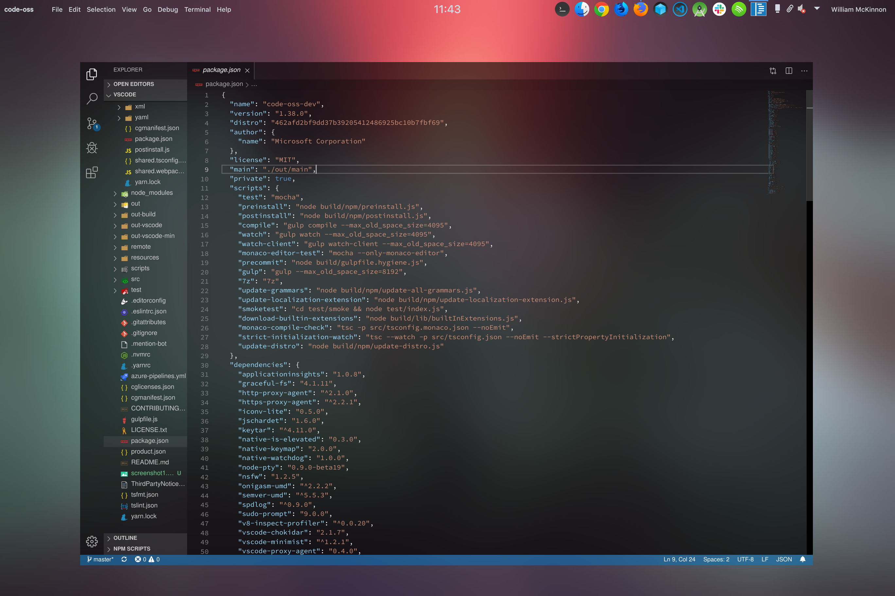

# *Transparent* Visual Studio Code - Open Source ("Code - OSS")
<!--  -->

The goal of this fork is to make a version of vscode that can have fully working window transparency and nice effects to go with that.

## Building And Running
[If the instructions below fail](https://github.com/Microsoft/vscode/wiki/How-to-Contribute#build-and-run)

### Build
1. navigate to the project `cd vscode`
2. install dependencies with `yarn`
3. build project: `yarn watch`

### Running
- Linux / macOS: `./scripts/code.sh`
- Windows: `.\scripts\code.bat`

## Packaging
vscode can be packaged for: `win32-ia32 | win32-x64 | darwin | linux-ia32 | linux-x64 | linux-arm`
- `gulp` is used to package
  - `vscode-[platform]`: Builds a packaged version for [platform]
  - `vscode-[platform]-min`: Builds a packaged and minified version for [platform]
    - Note: may need to add `--max-old-space-size=6500` to limit the memory used in packaging, my computer crashed a few times trying to package without that flag

- [Microsoft Documentation for Cross Compiling Debian Based Linux](https://github.com/Microsoft/vscode/wiki/Cross-Compiling-for-Debian-Based-Linux)

Example: Packaging for Arch Linux:
- `vscode-linux-x64-min`

## Current Transparent Themes
- dark vs, dark plus
- monokai

## License

Copyright (c) Microsoft Corporation. All rights reserved.

Licensed under the [MIT](LICENSE.txt) license.
